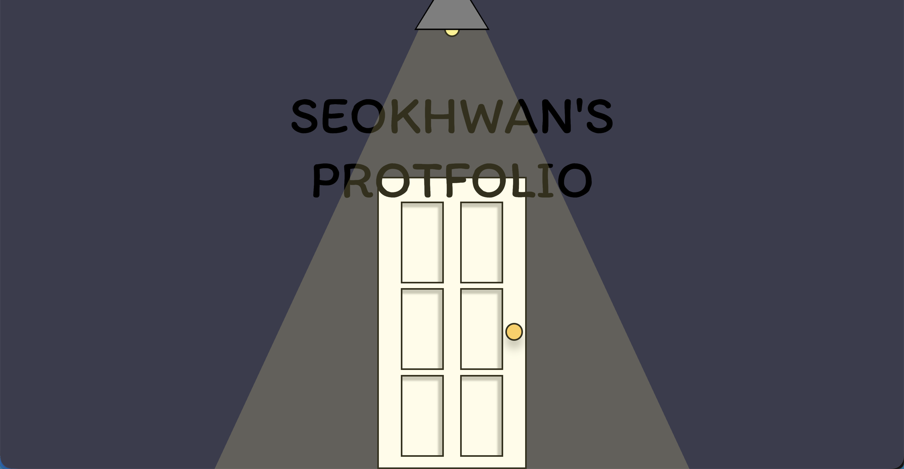
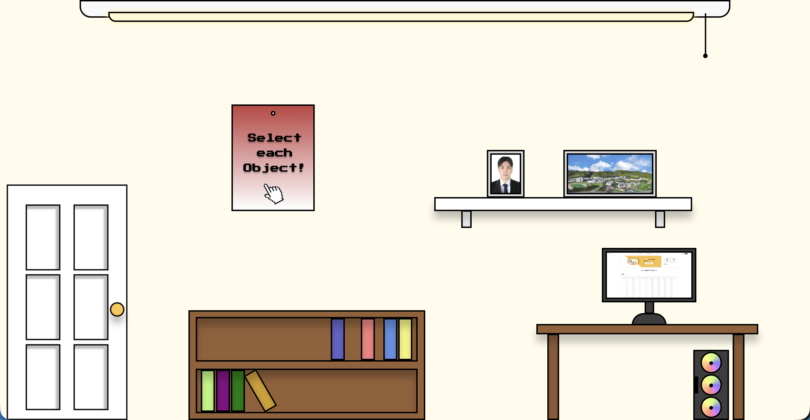

# KSH's Portfolio

# 📌 Portfolio Project 

## 🎯 프로젝트 개요  
- **프로젝트 기간:** `2025.01.31 ~ 지속적 업데이트`   
- **기술 스택:** `React`, `JavaScript`, `CSS3`, `HTML5`  

---

## 🏗️ 레이아웃 및 구조  
본 프로젝트는 **사용자가 직접 창을 열고 닫으며 탐색하는 환경**으로 구성되며, 총 `3가지 유형의 인터렉티브 모달`을 포함합니다.  

1. **Intro Scene:** 시작 화면 및 전체 분위기 설정 
2. **Interactive Objects:** 방 안에 배치된 클릭 가능한 오브젝트 (예: 액자, 책장, 데스크탑)
3. **Core Contents:** 오브젝트 클릭 시 나타나는 정보 창

### ✨ 주요 기능 및 UI/UX 요소  
| 오브젝트 | 연결되는 콘텐츠 | 모달 스타일 (구현 완료) | 개선 및 특징 |
| :--- | :--- | :--- | :--- |
| **📘 책장/책** | Skills (기술 스택) | **CSS 3D 변환 '책 펼치기' 애니메이션** | 고유의 3D `transform` 애니메이션 구현 및 CSS 구조 리팩토링 완료 |
| **🖼️ 선반/액자** | Profile (자기소개) | **액자 스타일 모달** | 모바일 환경의 **반응형 리팩토링**을 통해 가독성 및 레이아웃 안정성 확 |
| **💻 테이블/PC** | Projects (상세 정보) | **OS 윈도우 스타일 모달** | 헤더/본문 폰트 및 레이아웃 반응형 조정 완료 |

---

## 📏 웹사이트 및 기술적 특징

### 🔍 인터랙션 및 UI/UX

* **Object-Driven Interaction:** 방 오브젝트에 마우스를 올릴 때 시각적 피드백 제공 (Hover Effect) 및 클릭 시 모달 팝업
* **독창적인 모달 UI/UX:** 정적인 팝업 대신, 3D 책 애니메이션 및 OS 창 디자인을 도입하여 사용자 경험을 극대화

### 🖥️ 반응형 및 코드 품질

* **반응형 디자인:** **복잡한 모달 UI (3D 책, OS 창)**가 모바일 환경에서 스케일링 및 중앙 정렬되어 안정적으로 표시되도록 **레이아웃 안정성 확보** 완료
* **코드 품질 개선 (CSS Refactoring):**
    * 모달 영역의 **CSS 구조를 전면 리팩토링**하여 인라인 스타일 제거
    * 클래스 기반으로 분리 및 모듈화하여 유지보수성 및 확장성 향상
* **애니메이션 구현:** **CSS 3D `transform`** 및 **`transition`**을 활용한 모달 인터랙션 구현에 중점을 둠

---

## 🎨 디자인 컨셉  
- **🖼️ 디자인 목표:** 방 안에서 쉽게 볼 수 있는 오브젝트를 활용하여 레트로와 모던한 느낌의 포트폴리오

---

이 포트폴리오는 **React 기반**으로 개발되었으며, 독창적인 **Room 컨셉과 인터랙티브한 모달 요소**를 통해 깊은 인상을 남기도록 설계되었습니다. 🚀
